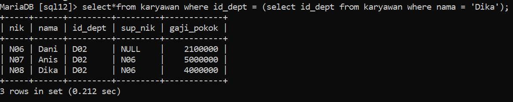
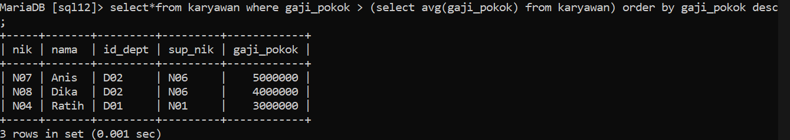
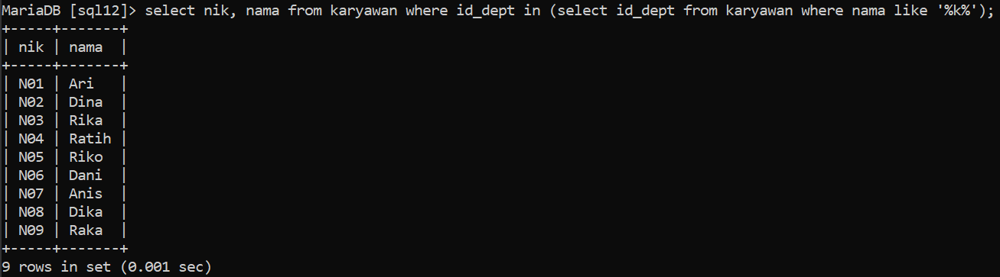
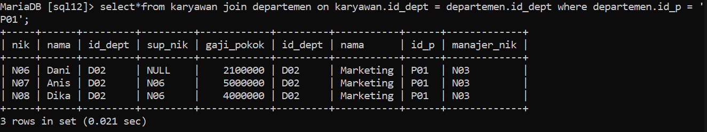
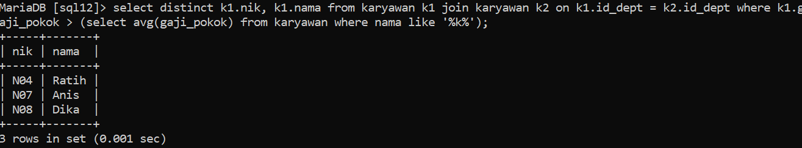

## Latihan Praktikum
Buat query untuk menampilkan:

1. Tampilkan data karyawan yang bekerja pada departemen yang sama dengan karyawan yang bernama Dika
`select*from karyawan where id_dept = (select id_dept from karyawan where nama = 'Dika');`

2. Tampilkan data karyawan yang gajinya lebih besar dari rata rata gaji semua karyawan. urutkan menurun berdasarkan besaran gaji
`select*from karyawan where gaji_pokok > (select avg(gaji_pokok) from karyawan) order by gaji_pokok descdesc;`

3. Tampilkan nik dan nama karyawan untuk semua karyawan yang bekerja di department yang sama dengan karyawan dengan nama yang mengandung huruf 'K'
`select nik, nama from karyawan where id_dept in (select id_dept from karyawan where nama like '%k%');`

4. Tampilkan data karyawan yang bekerja pada departemen yang ada di kantor pusat.
`select*from karyawan join departemen on karyawan.id_dept = departemen.id_dept where departemen.id_p = 'P01';`

5. Tampilkan nik dan nama karyawan untuk semua karyawan yang bekerja di department yang sama dengan karyawan dengan nama yang mengandung huruf 'K' dan yang gajinya lebih besar dari rata rata gaji semua karyawan
`select distinct k1.nik, k1.nama from karyawan k1 join karyawan k2 on k1.id_dept = k2.id_dept where k1.gaji_pokok > (select avg(gaji_pokok) from karyawan where nama like '%k%');`
